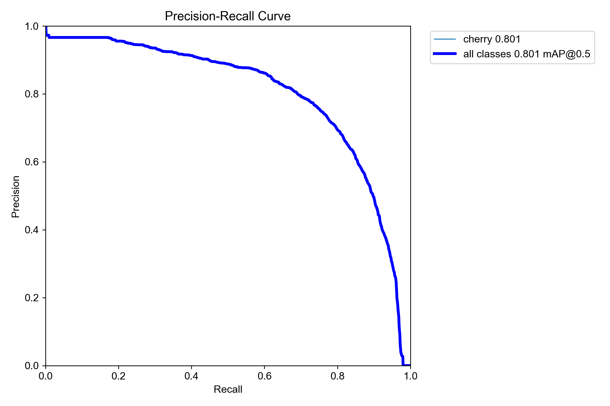
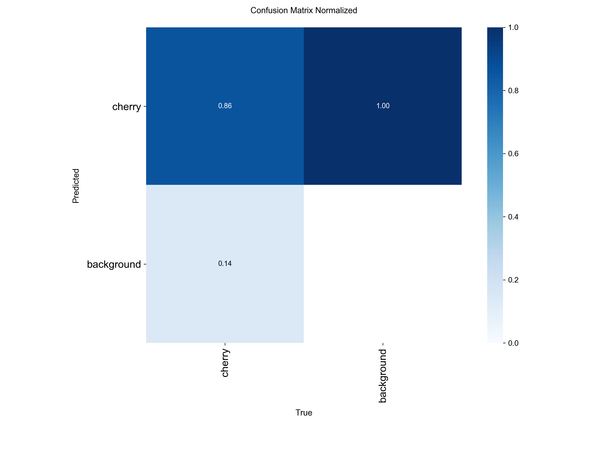
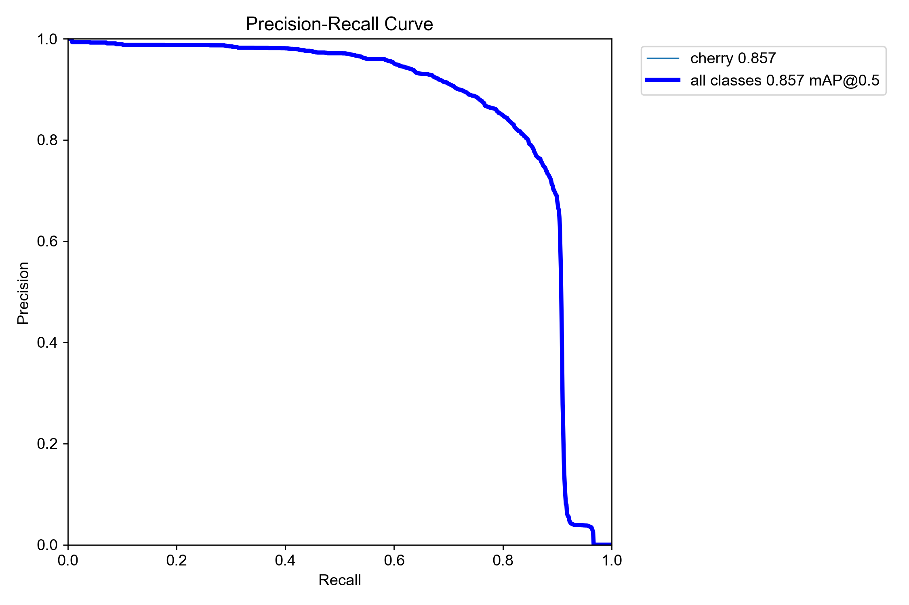
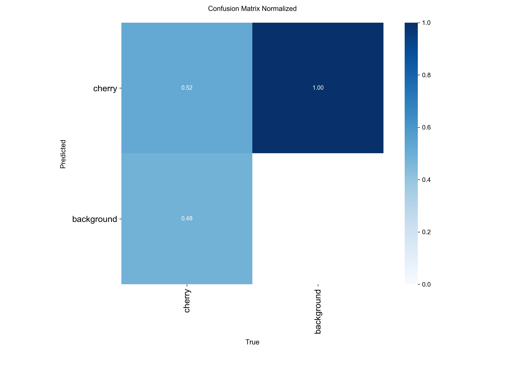
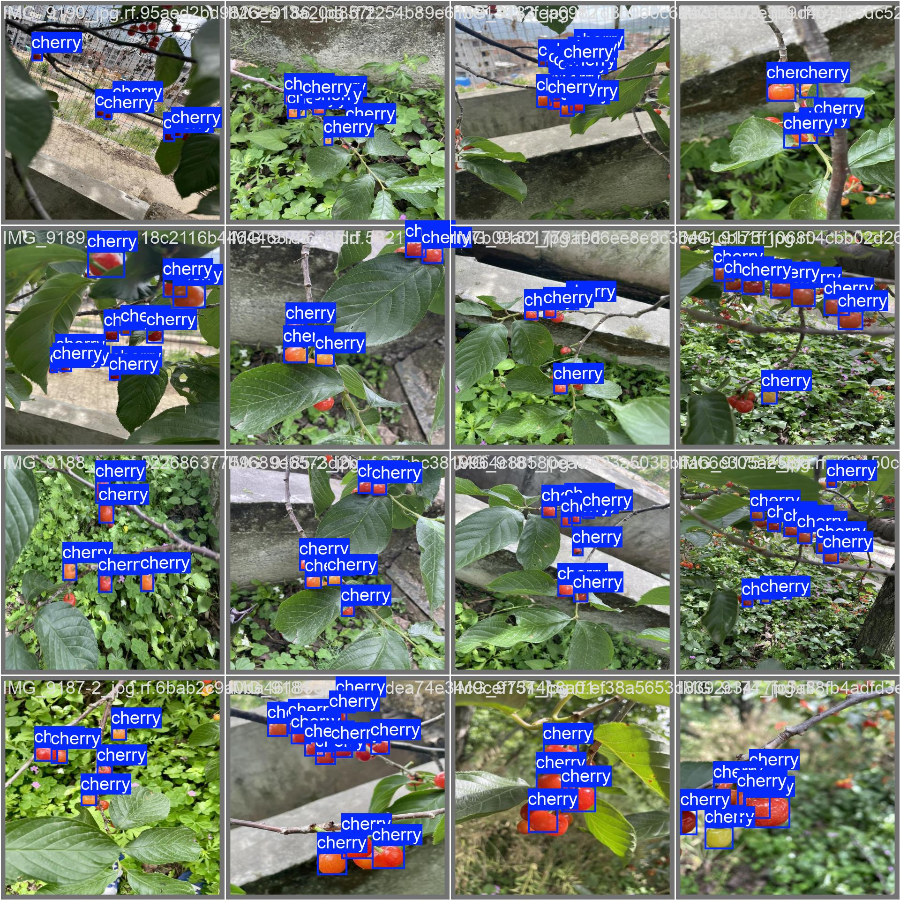
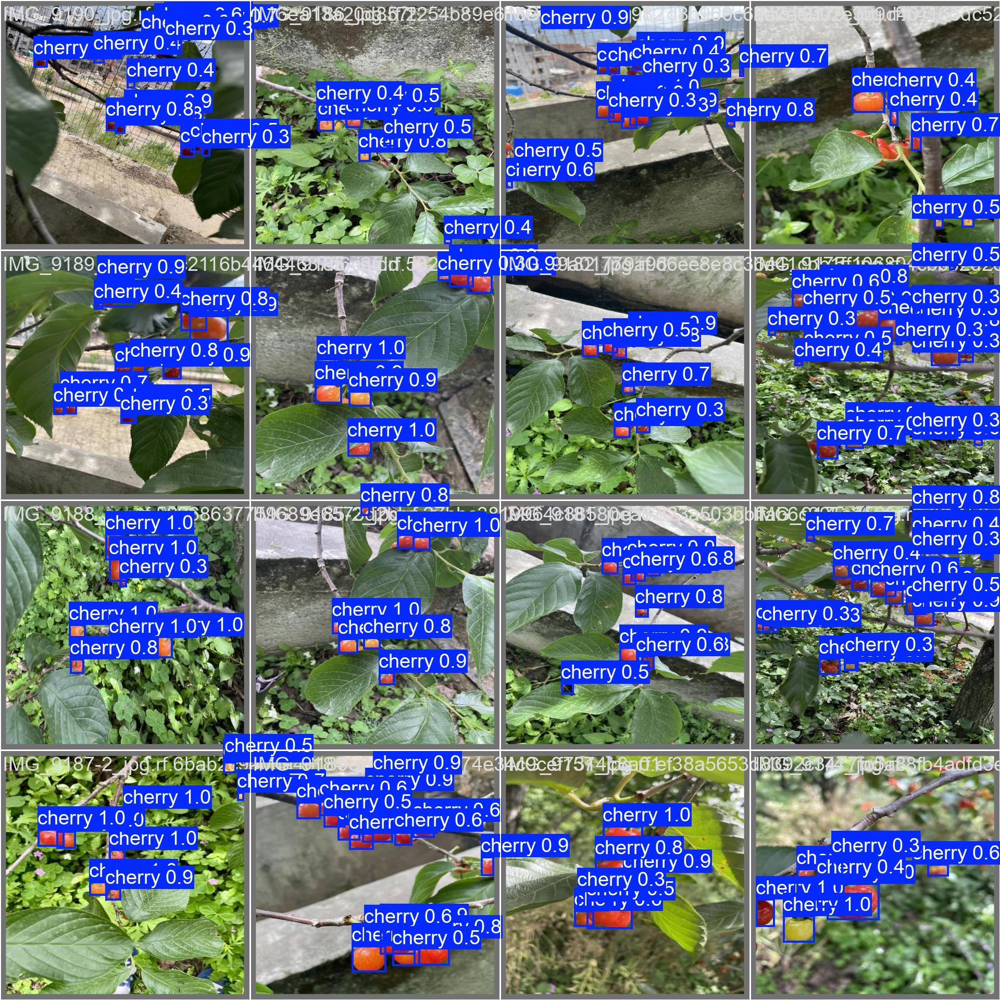
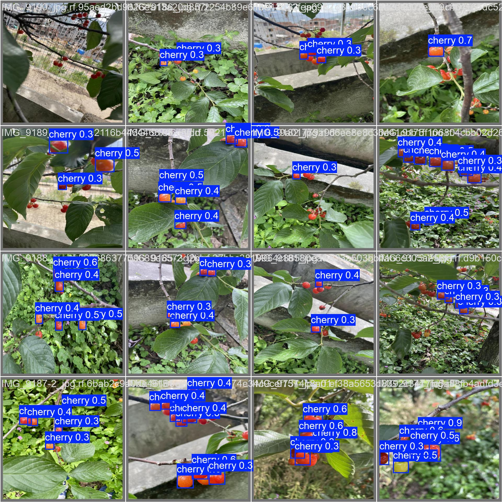

# Overview

This project builds an object detection model with minimal manual labeling by bootstrapping labels using Grounding DINO and iteratively improving them with YOLO.

The pipeline reduces labeling effort while achieving competitive detection performance.

# Setup 
git submodule update --init --recursive

# Install dependencies
To install Grounded SAM check: https://github.com/IDEA-Research/Grounded-SAM-2?tab=readme-ov-file 

# Results

Comparison between:
- training with auto-generated labels (starting with only images no labels)
- training with manually annotated labels

### Metrics (Validation)

| Model         | mAP50 | mAP50-95 | Precision | Recall |
|--------------|------|----------|----------|--------|
| Auto Label   | 0.801 | 0.547    | 0.752    | 0.753  |
| Manual Label | 0.857 | 0.625    | 0.864    | 0.775  |

**Limitation** 

The original dataset does not exhaustively label all cherry instances. As a result, the auto-labeling model may correctly identify cherries that are missing from the ground truth but are counted as false positives during evaluation. This makes the model appear less precise than it actually is. In reality, the true precision of the auto-labeling approach is likely higher than reported.

### Auto vs Manual Comparison

<table width="100%">
  <tr>
    <td width="50%" align="center">
       
      Auto PR Curve
    </td>
    <td width="50%" align="center">
       
      Auto Confusion Matrix
    </td>
  </tr>
  <tr>
    <td width="50%" align="center">
       
      Manual PR Curve
    </td>
    <td width="50%" align="center">
       
      Manual Confusion Matrix
    </td>
  </tr>
</table>

<!-- Row 2: Ground Truth -->
<table width="100%" style="margin-top: 15px;">
  <tr>
    <td align="center">
       
      

        Ground Truth
      

    </td>
  </tr>
</table>

<!-- Row 3: Predictions side by side -->
<table width="100%" style="margin-top: 15px;">
  <tr>
    <td width="50%" align="center">
       
      Auto Prediction
    </td>
    <td width="50%" align="center">
       
      Manual Prediction
    </td>
  </tr>
</table>

# Auto-Labeling Workflow (Bootstrapped Object Detection)

### 1. Initialize with a foundation model
- Start with Grounding DINO to generate initial labels
- These labels typically have:
  - high precision (correct when present)
  - low recall (misses many objects, especially in dense scenes)

---

### 2. Train an initial YOLO model
- Train a YOLO model using the images + Grounding DINO labels
- Even with missing labels, YOLO can learn general object patterns

---

### 3. Relabel using YOLO
- Run the trained YOLO model on the same dataset
- YOLO will:
  - detect additional objects that Grounding DINO missed
  - assign lower confidence to uncertain detections (due to noisy training labels)

- Apply confidence thresholding to filter predictions:
  - remove low-confidence boxes
  - keep high-confidence detections

---

### 4. Merge and Refine Labels

You now have two sources of labels:
- Grounding DINO (high precision, low recall)
- YOLO (higher recall, slightly noisier)

Options:

**1. Semi-automated review (highest quality)**
- Automatically accept boxes where both models agree
- Add boxes proposed by either model that are not already included
- Manually review uncertain or missing detections

**2. Automatic merge (faster, usually sufficient)**
- Combine boxes from both models
- Remove duplicates using an IoU threshold
---

### 5. Retrain YOLO
- Train a new YOLO model on the improved label set
- This model will:
  - improve recall
  - refine localization

---

### 6. Repeat (self-training loop)
- Re-run YOLO → generate better labels → retrain
- Each iteration:
  - improves label quality
  - improves model performance

Stop when:
- performance plateaus
- label improvements become marginal

## Note

This project uses a fully automated labeling pipeline via automatic merging, followed by a single round of label refinement and retraining.

## TODO

- [ ] Add a Jupyter notebook demonstrating the full auto-labeling workflow end-to-end
- [ ] Include example images and intermediate outputs (Grounding DINO → YOLO → merged labels

## Credit

This project uses the following models and data set:

- Grounding DINO (IDEA Research)  : https://github.com/idea-research/groundingdino
- YOLOv8 (Ultralytics)  : https://github.com/ultralytics/ultralytics
- Dataset / Images (Roboflow): https://roboflow.com
